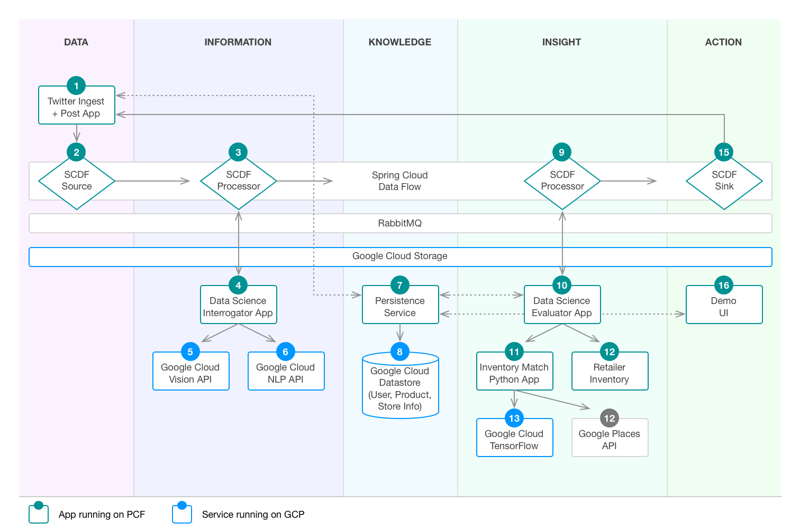
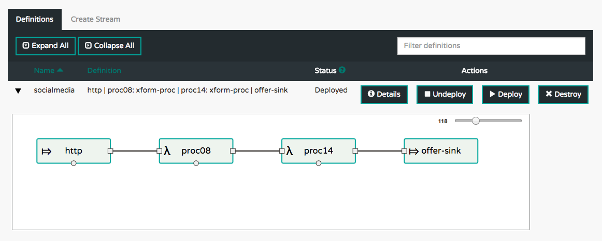

# PCF + GCP Retail Demo

Caveat: this version has no _Persistence Service_

## A demo for retailers to see how PCF and GCP turn streams of data into action. 

## Prerequisites

* A [Pivotal Cloud Foundry](https://pivotal.io/platform) (PCF) installation
* Install the GCP Service Broker, available on [Pivotal Network](https://network.pivotal.io/products/gcp-service-broker/)
  (source is [GitHub](https://github.com/GoogleCloudPlatform/gcp-service-broker))
* Java 8 JDK installed
* CF Command Line Interface (CLI):
    1. Navigate to the [releases page](https://github.com/cloudfoundry/cli/releases) on GitHub
    1. Download and install the appropriate one for your platform
* [Git client](https://git-scm.com/downloads) installed
* Using the Git client, clone [this repo](https://github.com/pivotal-cf/oss-pcf-gcp-retail-demo.git)
* Change into this newly created directory: `cd ./oss-pcf-gcp-retail-demo`

## Deploy some Python apps

There are a few Python applications used here, and the easiest way to get this all deployed
is to get a few of them running first.

* Image Resizing Service (used by `ds_app_09`):
    1. `git clone https://github.com/cf-platform-eng/image-resizing-service.git`
    1. `cd ./image-resizing-service/`
    1. `cf push`
    1. `cd -`
* The product recommendation is partially based on an image feature based match.  The following describes the requirements:
    1. A Collection of images of inventory items, in JPEG format
    1. The file names of these images encode the SKU, price, and description: `SKU-PRICE-THE_FULL_DESCRIPTION.jpg`
    1. Example image file name: `L57817-42-Polka_Dot_Wrap_Midi_Dress.jpg`
    1. The entire image collection is housed within a Google Cloud Storage bucket (can be a different one from the bucket created in the next section)
    1. Within that same bucket, there needs to be a "table of contents" (TOC) file, containing the image names, one per line (with no path)

* Inventory Matcher (used by `ds_app_15`):
    1. `cd ./inventory_match/`
    1. Edit `./manifest.yml`, setting the appropriate value for `IMAGE_TOC_URL` (see above)
    1. Create an instance of `google-storage`, specifying your `BUCKET_NAME`: `cf create-service google-storage standard storage -c '{ "name": "BUCKET-NAME" }`
    1. Push the app without starting it: `cf push --no-start`
    1. Bind to the storage instance you created: `cf bs image-match storage -c '{"role": "editor"}'`
    1. Set the health check to be processed based during the indexing phase, since the app will not be listening on its port during all that time (could be an hour): `cf set-health-check image-match process`
    1. Start the app up: `cf start image-match`
    1. Tail the logs as it indexes images: `cf logs image-match`
    1. Once that completes, it should print a message, saying it's listening on its port.  Once this happens, run the next step.
    1. Just run a standard `cf push`
    1. It stores the model as a Zip file in your storage bucket, so future restarts will be quicker.
    1. `cd -`
* Data Science Interrogator App:
    1. `cd ./ds_app_09/`
    1. Create an instance of GCP ML: `cf cs google-ml-apis default gcp-ml -c '{ "name": "gcp-ml" }'`
    1. Push the app without starting it: `cf push --no-start`
    1. Bind the app to the GCP ML service instance: `cf bs ds_app_09 gcp-ml -c '{ "role": "viewer" }'`
    1. Create an instance of the Redis service: `cf cs p-redis shared-vm redis` (NOTE: the code will look for `p-redis`)
    1. Bind this Redis instance to the app: `cf bs ds_app_09 redis`
    1. Start the app: `cf start ds_app_09`. Once it starts, the `urls:` field of the output will contain the value you need in the next step
    1. Create a service based on this app: `cf cups ds_app_09-service -p '{ "uri": "http://ds_app_09.YOUR_PCF_INSTALL.DOMAIN" }'`
    1. Use the app to bootstrap your `termSet` (see the code): `time curl http://ds_app_09.YOUR_PCF_INSTALL.DOMAIN/genTermSet`
    1. Similarly, for `labelSet`: `time curl http://ds_app_09.YOUR_PCF_INSTALL.DOMAIN/genLabelSet/400` (The `400` here is just a significant subset of your inventory set; I've been going with a value which is 10% of the total.)  This step takes some time as it hits the GCP Vision API for each image.
    1. `cd -`
* Data Science Evaluator App:
    1. `cd ./ds_app_15/`
    1. `cf push`
    1. Create a service based on this app: `cf cups ds_app_15-service -p '{ "uri": "http://ds_app_15.YOUR_PCF_INSTALL.DOMAIN" }'`
    1. *NOTE*: This app exposes a REST endpoint at `/lastMessage`, returning the most recent JSON data in the system
    1. `cd -`

## Install Spring Cloud Dataflow (SCDF) server

SCDF is the foundation of the data flow through this system.  The server orchestrates the data streams,
which are composed of modular building blocks.  These can be _Source_, _Processor_, or _Sink_.  There
is a large set of out of the box components available and, since they are Spring Boot apps, it is easy
to build a customized module.

1. Download the SCDF server and client JAR files, as documented [here](http://docs.spring.io/spring-cloud-dataflow-server-cloudfoundry/docs/current-SNAPSHOT/reference/html/_deploying_on_cloud_foundry.html#_download_the_spring_cloud_data_flow_server_and_shell_apps)
1. Configure the [manifest](./scdf/scdf_server_manifest.yml)
1. Ensure RabbitMQ, MySQL, and Redis tiles are installed (using Ops Manager, in PCF)
1. Create service instances of each of these, using `cf cs ...`
1. Push this app to PCF on GCP
1. Ensure it is running
1. Access the SCDF Dashboard (at `https://dataflow-server.YOUR_PCF_INSTALL.DOMAIN/dashboard/`)

## Set up the SCDF stream "data backbone" consisting of the following components
* An HTTP Source (item 6 in the diagram) which accepts incoming data from any of the social media or other
  adapters shown as items 1 through 6 in the diagram. We will use the out of the box HTTP source.
* A custom [SCDF Processor](./transform-proc) (item 8 in diagram), which hands off the data stream to the
  data science app shown as number 9 in the diagram
* A second instance of the same SCDF Processor, which will take the enriched data stream and hand it off
  to the second data science app, item 15 in the diagram
* This stream terminates at the [SCDF Sink](./offer-sink) component (item 19 in diagram), which will pass
  the offer notification to the delivery agent.

### Build and upload your SCDF modules
1. Build the Processor project: `( cd ./transform-proc/ && ./build.sh )`
1. Upload the resulting JAR, `./transform-proc/target/transform-proc-0.0.1-SNAPSHOT.jar`, into a Cloud Storage bucket,
   so SCDF is able to acces it.
1. Build the Sink project: `( cd ./offer-sink/ && ./build.sh )`
1. And upload its JAR, `./offer-sink/target/offer-sink-0.0.1-SNAPSHOT.jar`, to Cloud Storage.
1. In your Google Cloud Platform web console, within the Storage view, make each of these JAR files public by
   clicking the _Share publicly_ box

### Set up the SCDF stream
Here, you will register your modules in SCDF, define and then deploy a stream
1. Register the default list of modules with the UI
    * Use your browser to go to the [bulk import](http://dataflow-server.apps.YOUR_PCF_INSTALL.DOMAIN/dashboard/index.html#/apps/bulk-import-apps) UI
    * Click the _Action_ box associated with the _Maven based Stream Applications with RabbitMQ Binder_ line
    * Verify you have a set of modules by clicking the [APPS](http://dataflow-server.apps.YOUR_PCF_INSTALL/dashboard/index.html#/apps/apps) link in the dashboard UI.  They should be listed there.
1. Edit the script, `./scdf/scdf_create_stream.sh`, substituting the appropriate values under `# EDIT THESE VALUES`
1. Run the script: `./scdf/scdf_create_stream.sh`
NOTE: review [this code snippet](https://github.com/spring-cloud/spring-cloud-connectors/blob/3592f34bf3ea9091e5fbe052451d248d930ddd66/spring-cloud-core/src/main/java/org/springframework/cloud/Cloud.java#L193-L202) to see if our binding approach can be simplified (24 April 2017)

### Create your Twitter API credentials
1. Go to http://apps.twitter.com and click the _Create New App_ button.
1. Follow the steps on that page (requires you have a Twitter account), and the consumer key and secret will be generated.
1. After the step above, you will be redirected to your app's page.
1. There, create an access token under the _Your access token_ section.
1. Make a note of these for the next step, below.
 
### Set up the Twitter app
1. `cd ./twitter/`
1. Edit `./twitter.py`, setting the value for `OUR_SCREEN_NAME` to the one for your Twitter account.
1. Copy the `./manifest_template.yml` to `./manifest.yml`
1. Edit `./manifest.yml`, replacing each instance of `YOUR_KEY_HERE` with the appropriate value from your Twitter API credential set
1. Push the app without starting it: `cf push --no-start`
1. Using `cf apps`, note the value in the "urls" column for the app whose name ends in "-http"
1. Now, create a service named "http-hub" using a URI based on that value: `cf cups http-hub -p '{"uri": "http://dataflow-server-hf30QYI-socialmedia-http.YOUR_PCF_INSTALL.DOMAIN"}'`
1. Bind the Twitter app to this service instance: `cf bs twitter http-hub`
1. Start the Twitter app: `cf start twitter`
1. Create a service based on the Twitter app: `cf cups twitter-service -p '{ "uri": "http://twitter.YOUR_PCF_INSTALL.DOMAIN" }'`
1. Next, bind this service to the offer-sink app: `cf bs dataflow-server-SOME_ID_STRING-socialmedia-offer-sink twitter-service`
1. Finally, restage the offer-sink app to get the binding to take effect: `cf restage dataflow-server-SOME_ID_STRING-socialmedia-offer-sink`
1. `cd -`

### Set up the Web UI
This is a little single-page UI to show the progression from incoming data to outbound offer
* `cd web-ui`
* Edit the file ./src/main/webapp/scripts/controllers/main.js, changing the line under the comment `// EDIT THIS TO CORRESPOND TO THE URL OF YOUR "ds_app_15"` as indicated.  This is the REST endpoint providing data to this UI.
* Edit `./src/main/webapp/views/dashboard/home.html`, replacing `@bohochicsf` with your account's Twitter handle.
* Build: `./mvnw clean package`
* Push: `cf push`
* Access the UI in your web browser

### Review of the deployed system

* Navigating to the [STREAMS](http://dataflow-server.apps.YOUR_PCF_INSTALL.DOMAIN/dashboard/index.html#/streams/definitions)
  link on the SCDF Dashboard app, then clicking the arrow icon pointing to the _socialmedia_ app
  yields the view shown above.
* What we have now should provide the following:
    * If we run the Twitter app on our phone and follow _bohochicsf_
    * and we tweet something with a positive sentiment which also contains an image of clothing
    * we should receive tweet with an offer containing images of items similar to the one we tweeted, as in the image below

