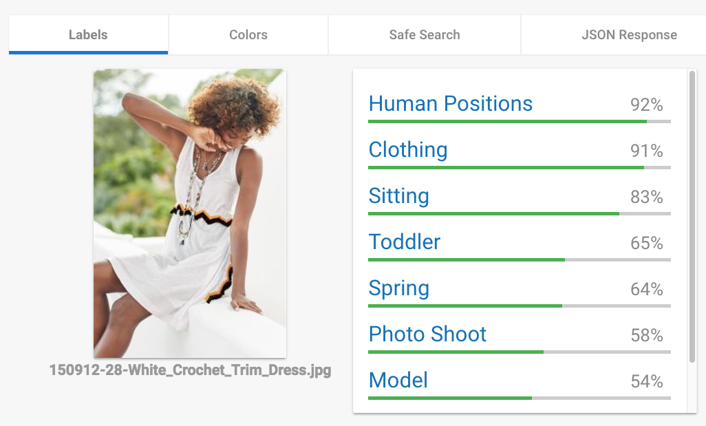

# Inventory Match App

This covers the area of functionality related to finding appropriate items within
the retailer's inventory.  This could be based on image similarity, text features,
inventory data for specific stores, etc.

## Data on products

One requirement is to get the data on products.  This would include, for each product,
an image, description, and price, and there should also be data on which store locations
have which items in stock.

* [Here](https://storage.googleapis.com/retail-image/toc.txt) is a collection of about
4,000 image files obtained using the approach described below. `toc.txt` lists all the JPEG files
which are within that `https://storage.googleapis.com/retail-image` bucket.  They are
typically 224x336; about 10kB each.  The file names encode information about the products
depicted; e.g. `L57816-39-Miss_Selfridge_Floral_Print_Dress.jpg` can be interpreted as
in the code found [here](./image_matcher.py):
```python
  (sku, price, desc) = fileName.split('-')
  desc = re.sub(r'_', ' ', desc.split('.')[0])
```
Note: price units here are pounds

* [This](./proxy_next.py) is one solution for "scraping" this data from a retailer's web
site.  The comments within the file describe its use:
```
All this code does is extend ProxyRequestHandler from "proxy2", and override
a couple of things so it stores images from the NEXT clothing retailer
web site (http://www.next.co.uk/), encoding the following data into the
file names:

  * item number
  * price (units are English pound)
  * item description, with underscores replacing any space or other non-word characters

I forked proxy2 here: https://github.com/mgoddard-pivotal/proxy2.git

To run this:

  * clone this fork
  * cd into the new directory, "proxy2"
  * copy this file into ./
  * ./proxy_next.py
  * Configure your computer to use this proxy, running on localhost:3123
  * Go to that NEXT web site and start to browse categories of clothing
  * You should begin to accumulate images in "crawl_data/"
```

* [Helper script](./copy_images_to_storage.sh) to push the data up into a Cloud Storage bucket

* The [inventory matcher](./image_matcher.py) is a Python Flask app which will search the
product inventory and return the most likely matches.  Currently, this is purely an image based
match, for a scenario where the Google Vision API labels an image as "clothing" or similar
(see below example).  **Details on how to deploy it are in the parent README.**




