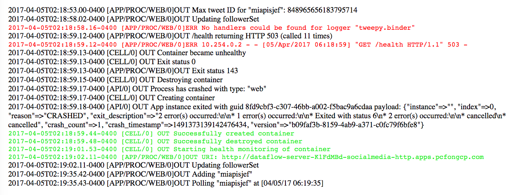

# Twitter app for the Retail Demo

## This app handles all interaction with the Twitter API
* Maintaining an up to date list of our followers
* For each of these, periodically checking their status
* Any offers which are to be delivered via Twitter

## For details on deploying this, running it, see the parent README
[Parent README](../README.md)

## Accurately reporting app health
This app provides a more robust health indicator than the default method.  The health
of the app is computed based on whether it is indeed updating the followers list and
checking the status of the users on the planned interval of time.  Refer to the
following in `./manifest_template.yml`:
```
  health-check-http-endpoint: /health
  health-check-type: http
```



This seemed worth noting: this morning, the logs in the Retail Demo's Twitter
app showed there had been an issue, one we'd seen before (see the red portion of
the image). We had added a new `/health` route in the app, which tracks whether
or not it is periodically updating the list of followers and polling these
users' statuses, sending an HTTP 503 response code if not.  As the above image
of the log activity indicates, this `/health` route within the app, coupled
with the manifest changes desecribed above, enables PCF to recover our app, as
seen in the log entries highlighted in green.  Yet another compelling feature
of the platform!

